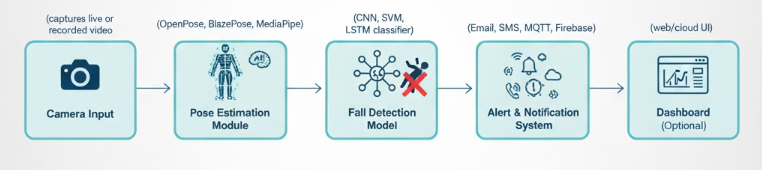

# 🛡️ SentinelCare: Advanced AI Fall Detection System  


---

## 👥 Collaborators

- [Dr. Irshad Ibrahim](https://github.com/Dr-irshad)
- [Umar Farooq](https://github.com/imumarfarooq)

---

## 🧠 Overview

**SentinelCare** is an **AI-powered fall detection system** that utilizes **pose estimation** and **machine learning** to detect falls and alert caregivers in real time.  
It is designed for **healthcare facilities**, **elderly homes**, and **smart surveillance** systems, focusing on **safety**, **privacy**, and **response efficiency**.

---

## ✨ Key Features

- 🚨 **Real-Time Fall Detection** – Detects abnormal human postures through pose estimation.
- 🎯 **High Accuracy** – Powered by cutting-edge models (OpenPose, BlazePose, MediaPipe).
- 🧩 **Edge & Cloud Compatible** – Deploy on Raspberry Pi, Jetson Nano, or cloud servers.
- 📢 **Smart Alerts** – Notifies via Email, SMS, or IoT (MQTT, Firebase).
- ⚙️ **Adjustable Sensitivity** – Customize thresholds to reduce false positives.
- 🔒 **Privacy-Preserving** – Uses skeletal keypoints instead of raw video.

---

## 🧰 Technologies Used

| Category | Tools & Frameworks |
|-----------|-------------------|
| **Language** | Python |
| **Deep Learning** | TensorFlow, PyTorch |
| **Pose Estimation** | OpenPose, BlazePose, MediaPipe |
| **Computer Vision** | OpenCV |
| **Web Frameworks** | Flask, FastAPI |
| **Messaging / IoT** | MQTT, Firebase, Twilio |
| **Data Processing** | NumPy, Pandas |

---

## 🏗️ System Architecture




> The SentinelCare architecture processes live or recorded video streams through pose estimation models and intelligent fall detection algorithms, followed by alert dispatch via IoT or messaging services.

---

## ⚙️ Installation

### Prerequisites

- Python ≥ 3.8  
- (Optional) Virtual environment  

### Setup

```bash
# Clone repository
git clone https://github.com/Dr-irshad/SentinelCare-Advanced-AI-Fall-Detection-System.git
cd SentinelCare-Advanced-AI-Fall-Detection-System

# Create and activate virtual environment
python -m venv venv
source venv/bin/activate  # On Windows use: venv\Scripts\activate

# Install dependencies
pip install -r requirements.txt
```

---

## 🧪 Datasets

You can train or test the system using publicly available datasets:

- [UR Fall Detection Dataset](https://sites.google.com/site/ufddataset/)
- [Le2i Fall Detection Dataset](http://le2i.cnrs.fr/Fall-detection-Dataset)
- [Fallen Person Dataset (Kaggle)](https://www.kaggle.com/datasets/)

---

## ☁️ Deployment Options

### 🧠 Edge Devices
- Convert models using **TensorFlow Lite** or **ONNX** for lightweight performance.
- Optimize with **OpenVINO** on Intel-based systems.

### 🌐 Cloud Infrastructure
- Deploy via **AWS Lambda**, **Google Cloud Functions**, or **Azure Functions**.
- Integrate with cloud storage and IoT alert systems.

---

## 🔔 Alerts & Notifications

| Type | Integration |
|------|--------------|
| **Email** | SMTP configuration |
| **SMS** | Twilio API |
| **IoT / Messaging** | MQTT, Firebase, or WebSockets |

---

## 🚀 Future Enhancements

- 🧬 Deep learning–based fall classification (LSTM / Transformer)
- 🎥 Multi-camera coordination for larger coverage
- ⌚ Integration with wearable IMU sensors
- 📊 Cloud dashboard with real-time analytics and logs

---

## 🤝 Contribution

Contributions are welcome!  
To contribute:

1. **Fork** this repository  
2. **Create** a feature branch (`feature/your-feature`)  
3. **Commit** your changes  
4. **Open** a Pull Request  

For discussions or suggestions, please open an **issue**.

---

## 📜 License & Notice

This repository provides **architectural and research documentation only**.  
All proprietary code developed under **FLAIR** remains confidential.  
Shared content is for **educational and research purposes** only.

---

### 🩺 About the Project

> **SentinelCare** is a collaborative AI research initiative exploring real-time human activity recognition for safety monitoring.  
> Developed with expertise in **computer vision**, **deep learning**, and **IoT-based alert systems**.  
>  
> This repository showcases the **design architecture**, **methodology**, and **deployment framework** — not proprietary implementation code.
